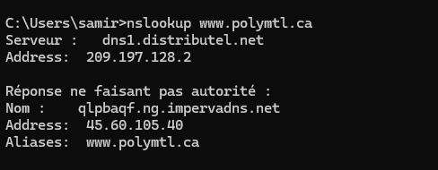
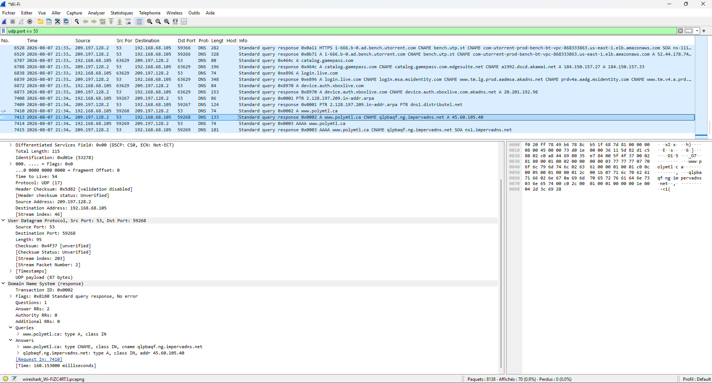

# 🔍 Laboratoire 01 — Analyse du trafic DNS avec Wireshark

## 🎯 Objectif
Analyser la séquence de résolution de noms DNS, l'encapsulation des paquets dans la pile OSI (Ethernet II, IPv4, UDP, DNS) et l'interaction avec une infrastructure de protection Web (WAF) à l'aide de Wireshark.

---

## 🛠️ Outils & Environnement
- **Analyseur de paquets :** Wireshark
- **Ligne de commande :** Windows CMD (`ipconfig /flushdns`, `ipconfig /flushdns`, `nslookup`)
- **Cible de test :** `www.polymtl.ca`

---

## 📝 Démarche expérimentale & Observations

### 1. Déclenchement de la requête DNS (Terminal)
Exécution de la commande `nslookup www.polymtl.ca` pour forcer la résolution du nom de domaine.

* **Serveur DNS interrogé :** `209.197.128.2` (`dns1.distributel.net`)
* **Redirection (CNAME) :** `qlpbaqf.ng.impervadns.net`
* **Adresse IP retournée :** `45.60.105.40`

---

### 2. Capture et analyse dans Wireshark
Application du filtre `udp.port == 53` pour isoler les paquets de résolution de noms.

#### Analyse de la pile d'encapsulation (Réponse `0x0002`) :
- **Ethernet II :** Adresses MAC de la carte réseau locale et du routeur/passerelle.
- **IPv4 :** Source `209.197.128.2` (Serveur DNS) $\rightarrow$ Destination `192.168.68.105` (Hôte).
- **UDP :** Port source `53` (DNS) $\rightarrow$ Port destination dynamique `59268`.
- **DNS Protocol :**
  - **Queries :** Question posée sur l'enregistrement `A` pour `www.polymtl.ca`.
  - **Answers :** Retour d'un enregistrement CNAME (`impervadns.net`) et de l'enregistrement A (`45.60.105.40`).

---

## 🛡️ Perspective & Analyse Sécurité

- **Protection Cloud & WAF :** L'existence de l'alias CNAME pointant vers Imperva démontre l'utilisation d'un pare-feu applicatif (WAF) cloud et d'un service de protection anti-DDoS. Cela permet de filtrer le trafic malveillant en amont avant qu'il n'atteigne le serveur Web d'origine de Polytechnique Montréal.
- **Importance de l'inspection DNS :** La surveillance du trafic UDP sur le port 53 est fondamentale pour détecter les anomalies réseau, telles que :
  - **L'exfiltration / le tunnel DNS (DNS Tunneling) :** détournement du protocole pour faire sortir des données confidentielles.
  - **L'empoisonnement DNS (DNS Poisoning) :** redirection malveillante d'utilisateurs vers de faux sites.
  - **La détection d'activités suspectes :** identification de domaines générés automatiquement (DGA) ou de communications avec des serveurs de commande et contrôle (C2).
