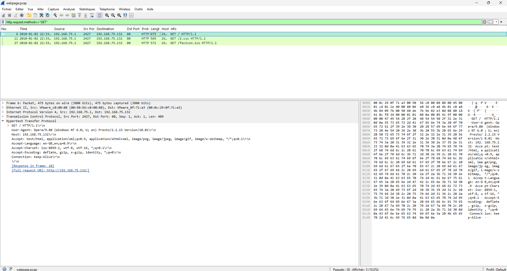
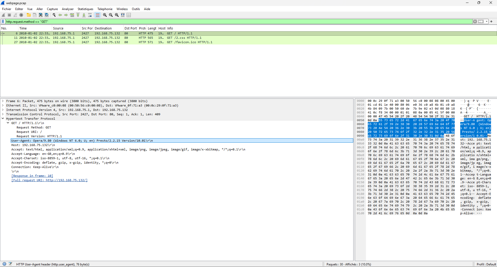
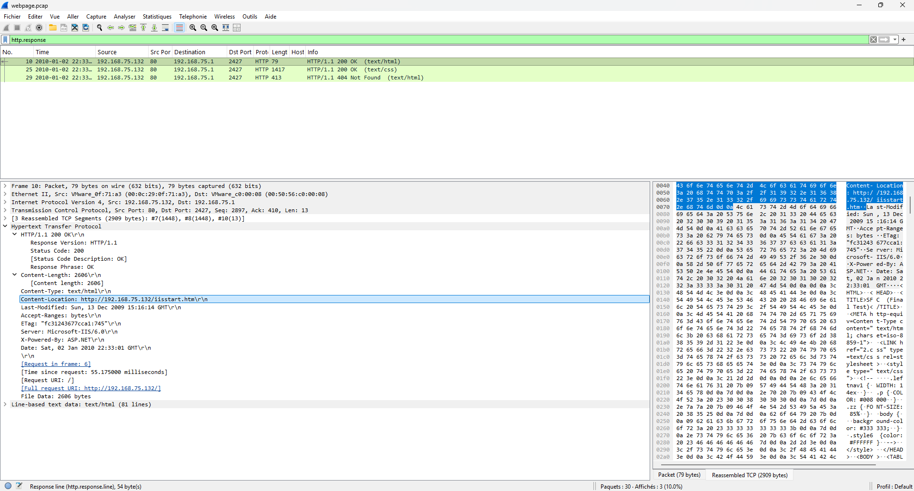

# 🌐 Laboratoire 02 — Analyse du trafic HTTP avec Wireshark

## 🎯 Objectif
Analyser une capture de trafic HTTP non chiffré (`.pcap`) pour inspecter les requêtes de l'hôte client (`GET`), évaluer les codes de réponse du serveur Web, et effectuer une empreinte applicative (*fingerprinting* : navigateur, système et serveur Web).

---

## 🛠️ Outils & Filtres Wireshark
- **Analyseur de paquets :** Wireshark
- **Filtres d'affichage utilisés :**
  - `http.request.method == "GET"` : Isoler les demandes de ressources initiées par le client.
  - `http.response` : Filtrer uniquement les réponses transmises par le serveur Web.

---

## 📝 Démarche expérimentale & Observations

### 1. Inspection des requêtes client (`GET`)

* **Fichiers demandés :**
  * Paquet #6 : `/` (fichier racine par défaut)
  * Paquet #11 : `/2.css` (feuille de style CSS)
  * Paquet #27 : `/favicon.ico` (icône du site Web)

---

### 2. Inspection des en-têtes du client (*User-Agent*)

* **Informations extraites du paquet #6 :**
  * **Navigateur :** Opera/9.80 (Windows NT 6.0)
  * **Langue :** `en-GB, en;q=0.9`
  * **Types d'images acceptés :** `png`, `jpeg`, `gif`, `x-xbitmap`

---

### 3. Évaluation des réponses serveur

* **Codes de statut & transfert :**
  * Paquet #10 (`200 OK`) : Fichier `iisstart.htm` (Transféré avec succès)
  * Paquet #25 (`200 OK`) : Fichier `2.css` (Transféré avec succès)
  * Paquet #29 (`404 Not Found`) : Fichier `favicon.ico` (Échec : ressource introuvable)

---

### 4. Synthèse de l'empreinte applicative

| Paramètre | Valeur identifiée | En-tête HTTP source |
| :--- | :--- | :--- |
| **Nom de fichier par défaut** | `iisstart.htm` | `Content-Location` |
| **Formats d'image acceptés** | `png`, `jpeg`, `gif`, `x-xbitmap` | `Accept` |
| **Langue & Encodage** | `en-GB` / `iso-8859-1`, `utf-8`, `utf-16` | `Accept-Language` & `Accept-Charset` |
| **Navigateur Web client** | `Opera/9.80` (Windows NT 6.0) | `User-Agent` |
| **Technologie Serveur** | `Microsoft-IIS/6.0` (ASP.NET) | `Server` & `X-Powered-By` |
| **Horodatage de la session** | Samedi 2 janvier 2010 à 22:33:01 GMT | `Date` |

---

## 🛡️ Perspective & Analyse Sécurité

- **Exposition du protocole clair (HTTP) :** Le manque de chiffrement TLS/SSL permet la lecture directe du contenu et des en-têtes applicatifs (*User-Agent*, extensions, paramètres).
- **Surface d'attaque & Fingerprinting :** La présence explicite de l'en-tête `Server: Microsoft-IIS/6.0` permet à un attaquant d'identifier immédiatement la version exacte du service Web pour rechercher des failles ciblées.
