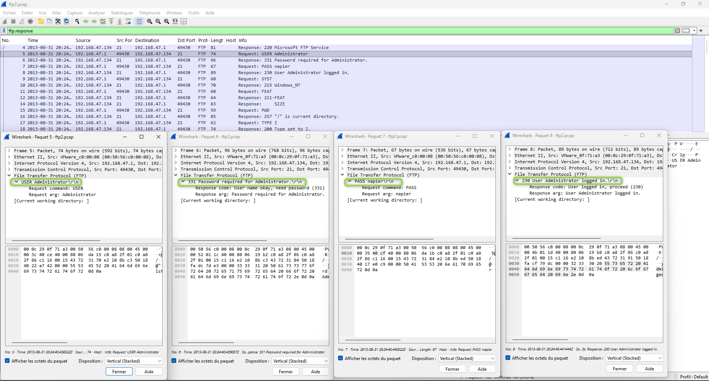
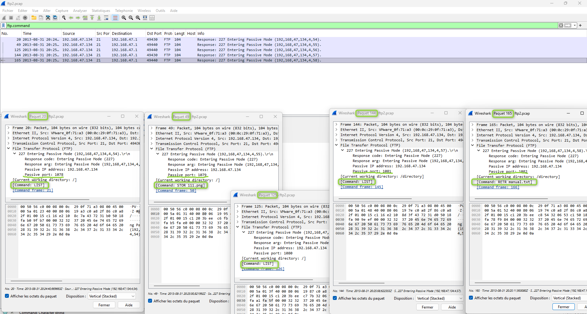
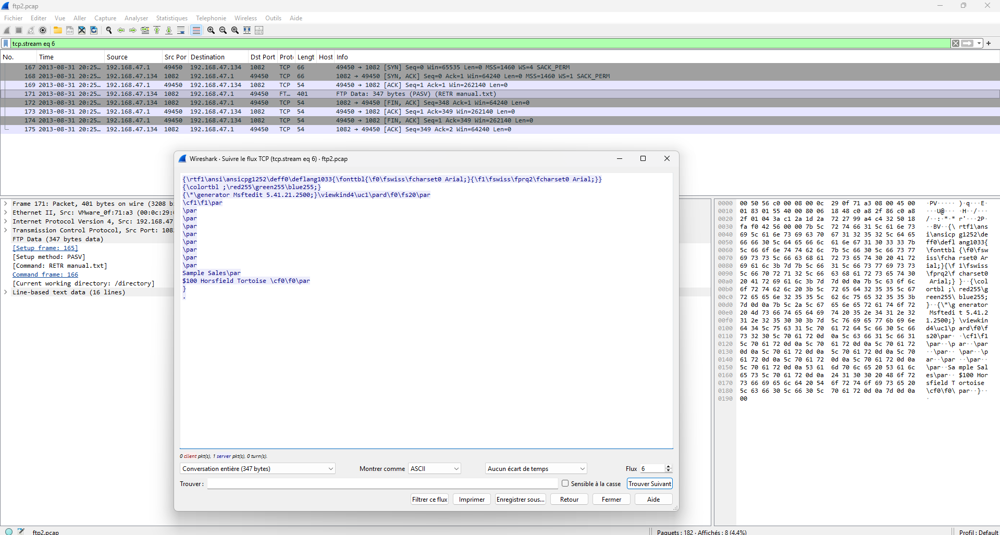

# 📂 Laboratoire 03 — Analyse du trafic FTP avec Wireshark

## 🎯 Objectif
Analyser une capture réseau du protocole **FTP** (`.pcap`) pour étudier la transmission des identifiants en clair, la navigation dans les répertoires, le transfert de fichiers ainsi que le fonctionnement du **mode passif (PASV)** et le calcul dynamique des ports de données.

---

## 🛠️ Outils & Filtres Wireshark
- **Analyseur de paquets :** Wireshark
- **Filtres d'affichage utilisés :**
  - `tcp.flags.syn == 1` : Identification du Handshake TCP d'ouverture.
  - `ftp.command` & `ftp.response` : Inspection du canal de contrôle (commandes et codes de réponse).
  - `ftp.request.command == "LIST"` : Repérage des listages de répertoires.
  - `ftp.response.code == 227` : Calcul des ports dynamiques attribués en mode passif.
  - `tcp.stream eq 6` : Reconstitution du flux de données pour l'extraction de fichiers.

---

## 📝 Démarche expérimentale & Réponses aux questions

### 1. Authentification & Connexion en clair

- **Adresse IP du serveur FTP :** `192.168.47.134` (répond sur le port TCP 21).
- **Handshake TCP (3-Way Handshake) :** Paquets **#1** (SYN), **#2** (SYN-ACK) et **#3** (ACK).
- **Identifiants extraits en clair :**
  - **Nom d'utilisateur :** `Administrator` (Paquet #5 / Commande `USER`)
  - **Mot de passe :** `napier` (Paquet #7 / Commande `PASS`)
- **Codes de réponse clés :** `220` (Service prêt), `331` (Mot de passe requis), `230` (Connexion réussie).

---

### 2. Analyse du Mode Passif (PASV) & Calcul de ports

En mode passif (`PASV`), le serveur attribue dynamiquement un port sur lequel le client se connecte pour le transfert de données. La formule de calcul du port à partir des deux derniers octets $(p_1, p_2)$ de la réponse `227` est :

$$\text{Port} = (p_1 \times 256) + p_2$$

| Paquet | Réponse FTP 227 | Octets $(p_1, p_2)$ | Port calculé | Commande associée |
| :---: | :--- | :---: | :---: | :--- |
| **#20** | `Entering Passive Mode (192,168,47,134,4,54)` | $(4, 54)$ | **1078** | `LIST` |
| **#49** | `Entering Passive Mode (192,168,47,134,4,55)` | $(4, 55)$ | **1079** | `STOR 111.png` (Upload) |
| **#125** | `Entering Passive Mode (192,168,47,134,4,56)` | $(4, 56)$ | **1080** | `LIST` |
| **#144** | `Entering Passive Mode (192,168,47,134,4,57)` | $(4, 57)$ | **1081** | `LIST` (Contenu : `1.docx`, `manual.txt`) |
| **#165** | `Entering Passive Mode (192,168,47,134,4,58)` | $(4, 58)$ | **1082** | `RETR manual.txt` (Download) |

---

### 3. Extraction et contenu du fichier téléversé/téléchargé

- **Fichier téléversé (Upload - Client $\rightarrow$ Serveur) :** `111.png` (Commande `STOR` au paquet #50).
- **Fichier téléchargé (Download - Serveur $\rightarrow$ Client) :** `manual.txt` (Commande `RETR` au paquet #166).
- **Contenu du fichier `manual.txt` (extrait du flux TCP #6) :**
  > `Sample Sales`  
  > `$100 Horsfield Tortoise`

---

## 🛡️ Perspective & Analyse Sécurité

- **Incapacité de confidentialité (Protocole en clair) :** Toutes les données (identifiants `Administrator`/`napier` et contenu des fichiers) ont pu être interceptées directement depuis la capture réseau sans aucune opération de déchiffrement.
- **Bypass Pare-feu via le Mode Passif :** Le mode passif est préféré lorsque le client est derrière un NAT/Pare-feu, car l'initiative de la connexion de données vient du client vers un port éphémère du serveur ($1078 \rightarrow 1082$).
- **Recommandations de sécurisation :**
  - Abandonner FTP au profit de **SFTP** (SSH File Transfer Protocol) ou **FTPS** (FTP over TLS/SSL) pour chiffrer les canaux de contrôle et de données.
  - Restreindre la plage de ports éphémères du mode passif sur le serveur FTP pour limiter l'exposition réseau.
