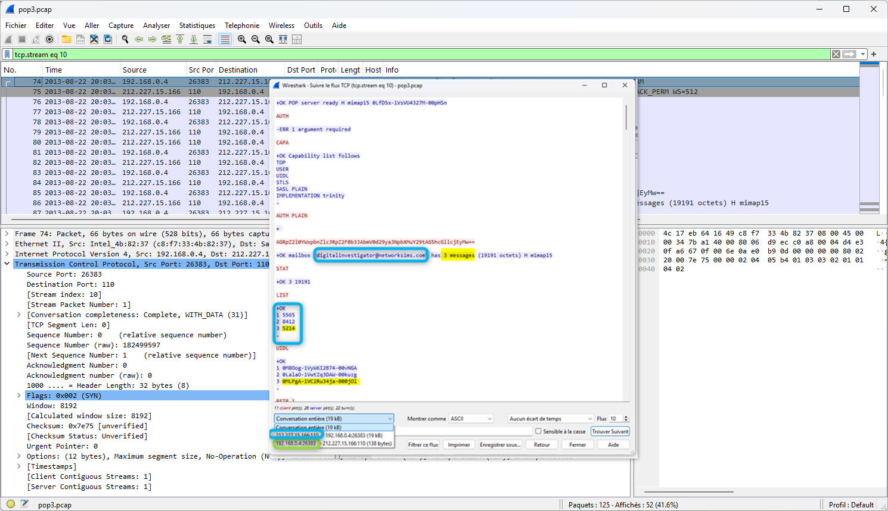
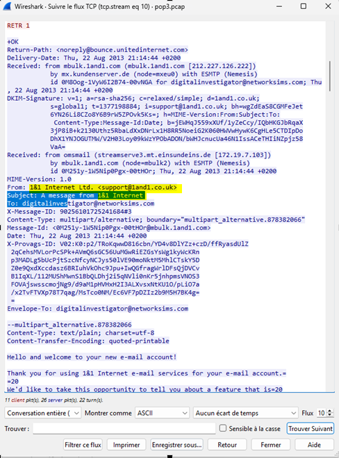
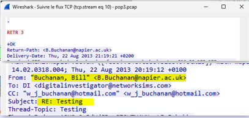
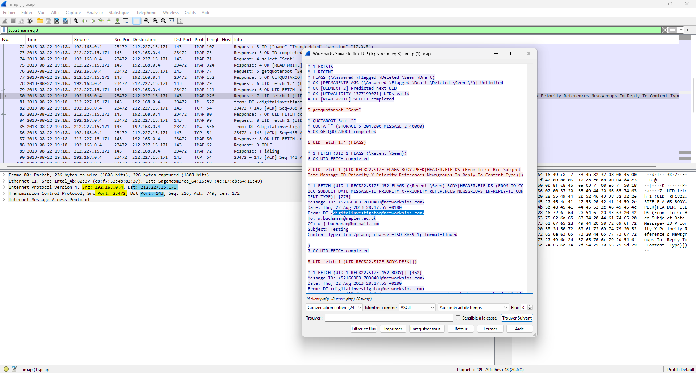
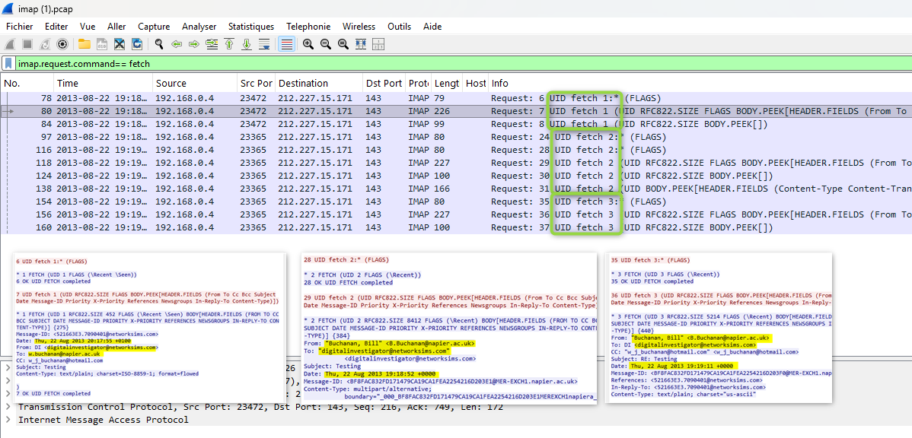

# 📂 Laboratoire 04 — Analyse des protocoles de messagerie (SMTP, POP3, IMAP) avec Wireshark

## 🎯 Objectifs
- Analyser le fonctionnement et les échanges en clair des principaux protocoles de messagerie électronique : **SMTP** (envoi), **POP3** (réception/relève) et **IMAP** (gestion/synchronisation).
- Extraire les métadonnées clés des courriels : adresses IP, ports, expéditeurs, destinataires, horodatages et identifiants.
- Reconstituer le contenu texte et la structure des messages via le suivi de flux TCP dans Wireshark.
- Évaluer les risques de sécurité liés à l'utilisation de ces protocoles sans chiffrement (TLS/SSL).

---

## 🛠️ Outils & Filtres Wireshark
- **Analyseur de paquets :** Wireshark
- **Filtres d'affichage principaux :**
  - `smtp` : Inspection du canal de contrôle SMTP (port TCP 25).
  - `pop` : Filtre des commandes/réponses POP3 (port TCP 110).
  - `imap` : Filtre des requêtes/réponses IMAP (port TCP 143).
  - `tcp.stream eq X` : Reconstitution intégrale des conversations de messagerie.

---

## 📝 Analyse approfondie par protocole

### 1. Protocole SMTP (Simple Mail Transfer Protocol) — Envoi de courriel

Le protocole **SMTP** est utilisé pour le transfert et l'acheminement des courriels entre clients et serveurs (ou entre serveurs de messagerie).

#### 📍 Métadonnées de la session :

- **Hôte émetteur (Client) :** `192.168.0.12` | **Port source TCP :** `1713`
- **Serveur SMTP (Destination) :** `192.168.0.13` | **Port service TCP :** `25`
- **Initialisation :** Handshake TCP à partir du paquet #1 (`SYN` de `.12` vers `.13:25`).

#### ✉️ Informations du courriel :
- **Expéditeur (`MAIL FROM`) :** `martin.tor@4salet.com`
- **Destinataire (`RCPT TO`) :** `bert.manly@five8nine.com`
- **Date / Horodatage d'envoi :** 11 mars 2013 à 22:10:34 UTC
- **Objet (Subject) :** *(Vide)*
- **Contenu du message :** Contient uniquement un point `.`
- **Séquence de fin de message SMTP :** `<CRLF>.<CRLF>` (Retour à la ligne, point, retour à la ligne).

---

### 2. Protocole POP3 (Post Office Protocol v3) — Relève de boîte aux lettres

Le protocole **POP3** permet la récupération des messages depuis un serveur distant vers un client local.

#### 📍 Métadonnées de la session :

- **Hôte client :** `192.168.0.4` | **Port source TCP :** `26383`
- **Serveur POP3 :** `212.227.15.166` | **Port service TCP :** `110`
- **Boîte aux lettres consultée :** `digitalinvestigator@networksims.com`
- **Nombre total de messages en boîte de réception :** `3`
- **Identifiant du Message 3 :** `5214` (`0MLPgA-1VC2Ru34ja-000jOl`)

#### 📩 Détails des messages extraits (`RETR x`) :
- **Message 1 (`RETR 1`) :**
 
  - **Expéditeur :** `1&1 Internet Ltd.` (`support@1and1.co.uk`)
  - **Sujet :** `A message from 1&1 Internet`
  - **Aperçu :** Message de bienvenue présentant les services WebMail 2.0.
- **Message 2 (`RETR 2`) :**

  - **Expéditeur :** `"Buchanan, Bill"` (`B.Buchanan@napier.ac.uk`)
  - **Sujet :** `Testing`
  - **Aperçu :** Échange amical (*"How are you tooo... I am fine."*) suivi de la signature officielle d'Edinburgh Napier University.
- **Message 3 (`RETR 3`) :**

  - **Expéditeur :** `"Buchanan, Bill"` (`B.Buchanan@napier.ac.uk`)
  - **Sujet :** `Testing`
  - **Aperçu :** Réponse incluant les coordonnées complètes, liens (Research, YouTube, Skype) et le message d'origine transmis par `digitalinvestigator@networksims.com`.

---

### 3. Protocole IMAP (Internet Message Access Protocol) — Gestion avancée

Le protocole **IMAP** permet la synchronisation et la gestion des courriels directement sur le serveur sans obligation de téléchargement local préalable.

#### 📍 Métadonnées de la session :

- **Hôte client :** `192.168.0.4` | **Port source TCP :** `23472`
- **Serveur IMAP :** `212.227.15.171` | **Port service TCP :** `143`
- **Boîte aux lettres consultée :** `digitalinvestigator@networksims.com`
- **Indicateur de suivi des messages :** Utilisation des commandes `UID FETCH` pour interroger et récupérer les métadonnées de chaque message.

#### 📩 Détails des messages identifiés :

1. **Message 1 :**
   - **De :** `"Buchanan, Bill"` (`B.Buchanan@napier.ac.uk`)
   - **Pour :** `digitalinvestigator@networksims.com`
   - **Sujet :** `Testing` | **Date :** `Thu, 22 Aug 2013 19:18:52 +0000`
2. **Message 2 :**
   - **De :** `"Buchanan, Bill"` (`B.Buchanan@napier.ac.uk`)
   - **Pour :** `digitalinvestigator@networksims.com`
   - **Sujet :** `RE: Testing` | **Date :** `Thu, 22 Aug 2013 19:19:11 +0000`
3. **Message 3 :**
   - **De :** `digitalinvestigator@networksims.com`
   - **Pour :** `"Buchanan, Bill"` (`B.Buchanan@napier.ac.uk`)
   - **Sujet :** `Testing` | **Date :** `Thu, 22 Aug 2013 20:18:00 +0000`

---

## 🛡️ Synthèse & Analyse de Sécurité

- **Vulnérabilité aux interceptions (Sniffing) :** Les protocoles historiques (SMTP:25, POP3:110, IMAP:143) transmettent les identifiants, les en-têtes et le corps des messages en texte clair. Tout attaquant en position d'écoute sur le réseau (Man-in-the-Middle) peut lire l'intégralité des échanges.
- **Extraction judiciaire (Digital Forensics) :** Wireshark permet de reconstruire l'arbre complet d'une conversation de messagerie, d'identifier les adresses IP d'origine et d'extraire le contenu des courriels sans altérer les preuves.
- **Recommandations de sécurisation :**
  - Exiger l'utilisation de déclinaisons chiffrées : **SMTPS** (port 465 ou submission 587 avec STARTTLS), **POP3S** (port 995) et **IMAPS** (port 993).
  - Mettre en œuvre les mécanismes d'authentification et d'alignement de domaine : **SPF**, **DKIM** et **DMARC** pour prévenir l'usurpation d'usurpation d'adresse d'expéditeur (Email Spoofing).
